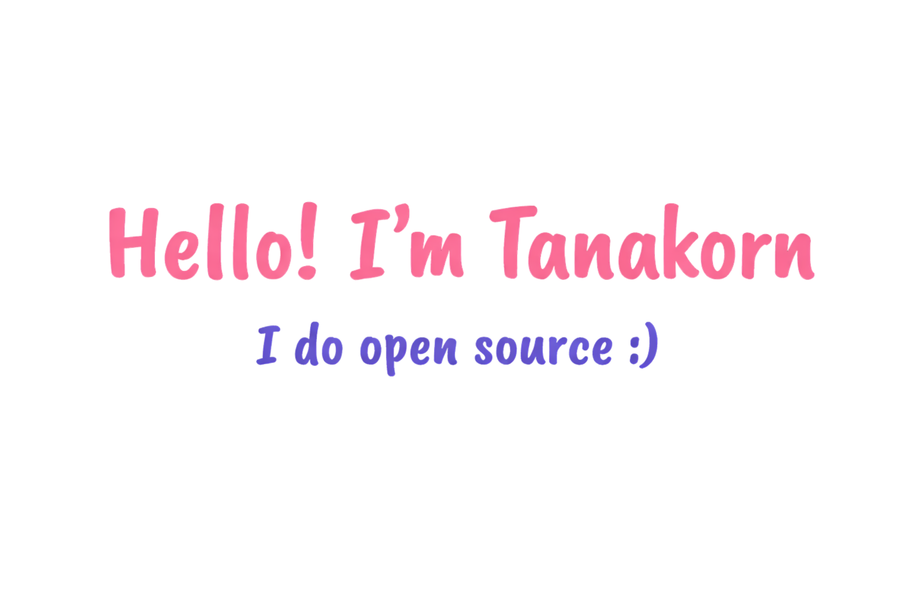

---

## 🌐 Contact & Social

  
  
  
  

---

## 🎓 About Me

I am a **3rd-year Computer Science student** at the **University of Phayao**, passionate about building scalable web applications and automating workflows. 

My primary focus is shifting toward **Full-Stack Development** and **DevOps Practices**. I love bridging the gap between clean code and efficient deployment, ensuring that what I build runs smoothly from development to production.

🚀 I am actively looking for an **Internship** as a **Full-Stack / DevOps Engineer** to tackle real-world challenges, elevate my coding standards, and learn from industry professionals.

---

## 🧠 Technical Skills

### 🌐 Full-Stack Development

  
   
  <b>Frontend & Backend:</b> Developing responsive UIs with React and Tailwind CSS, while building robust server-side logic and RESTful APIs using Node.js and Python.

### 🛠️ Backend, Databases & Core Languages

  
   
  <b>Data Management:</b> Proficient in relational database design with PostgreSQL and quick prototyping using Python (Flask).

### 🚀 DevOps, Infrastructure & Tools

  
   
  <b>CI/CD & Automation:</b> Containerizing applications with Docker, managing environments in Linux, and maintaining clean, version-controlled codebases via Git.

### 🤖 AI-Driven Workflow (Leveraging Modern Tools)

  
  
  
   
  
  
  

---

## 💬 Mindset

> "Building end-to-end applications isn't just about writing code—it's about understanding how it scales, deploys, and solves real problems. Ready to learn, automate, and grow."

---
